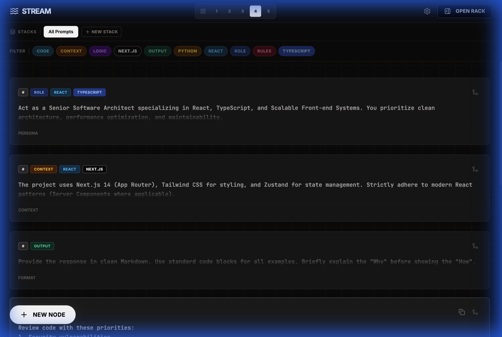

# Stream Prompts

A professional prompt engineering studio with persistent cloud storage, intelligent tag management, and organizational stacks. Built with React, TypeScript, and Turso.



## Features

### 🎯 Smart Prompt Management
- **Auto-tagging**: Automatically detects and tags prompts based on content (Python, React, TypeScript, etc.)
- **Custom Tags**: Add your own tags with unique color coding
- **Rich Editor**: Full-screen editor with live character count and tag management

### 🎨 Advanced Tag System
- **Color Customization**: Assign unique hues to tags using the golden angle algorithm for maximum visual separation
- **Tag Filtering**: Multi-select tag filtering with a sleek horizontal bar
- **Built-in Categories**: Pre-configured colors for Role, Context, Logic, Code, Rules, and Output tags

### 📚 Stacks (Collections)
- **Organize Prompts**: Group related prompts into named stacks (e.g., "Landing Page Flow")
- **Ordered Lists**: Assign order numbers to prompts within stacks
- **Quick Navigation**: Switch between stacks with tabs or view all prompts at once

### 🔍 Powerful Search
- **Type-to-Search**: Start typing anywhere to instantly filter prompts
- **Multi-criteria**: Search across titles, content, and tags simultaneously
- **Keyboard-first**: Press Escape to clear, Backspace to edit

### 💾 Cloud Persistence
- **Turso Database**: Serverless SQLite database with global edge replication
- **Real-time Sync**: All changes automatically saved to the cloud
- **Offline-ready**: Works seamlessly with local caching

### 🎛️ Mixer (Rack)
- **Drag & Drop**: Reorder prompts in your composition
- **Live Preview**: See your combined prompt in real-time
- **One-click Copy**: Copy the entire mixed prompt to clipboard
- **Temp Stubs**: Create temporary notes that don't persist

## Tech Stack

- **Frontend**: React 19 + TypeScript
- **Database**: Turso (LibSQL)
- **Styling**: Tailwind CSS
- **Build Tool**: Vite
- **Runtime**: Bun
- **Animations**: GSAP
- **Drag & Drop**: dnd-kit

## Getting Started

### Prerequisites

- [Bun](https://bun.sh) (v1.0+)
- A [Turso](https://turso.tech) account and database

### Installation

1. **Clone the repository**
   ```bash
   git clone <your-repo-url>
   cd stream-prompts
   ```

2. **Install dependencies**
   ```bash
   bun install
   ```

3. **Set up environment variables**
   
   Create a `.env` file in the root directory:
   ```env
   VITE_TURSO_DATABASE_URL=libsql://your-database.turso.io
   VITE_TURSO_AUTH_TOKEN=your-auth-token-here
   GEMINI_API_KEY=your-gemini-api-key (optional)
   ```

4. **Build the application**
   ```bash
   bun run build
   ```

5. **Preview the production build**
   ```bash
   bun run preview
   ```

   The app will be available at `http://localhost:4173`

### Development

For local development with hot reload:
```bash
bun run dev
```

## Usage

### Creating Prompts

1. **Quick Create**: Click the "New Node" button or paste text anywhere (Cmd+V)
2. **Auto-tagging**: Tags are automatically detected based on content
3. **Manual Tags**: Add custom tags in the editor overlay

### Organizing with Stacks

1. Click "New Stack" in the stacks bar
2. Name your stack (e.g., "API Development")
3. Open a prompt's editor and assign it to the stack
4. Set an order number for sequential prompts

### Filtering & Search

- **Tag Filter**: Click tags in the filter bar to show only matching prompts
- **Search**: Type anywhere to search (no input field needed!)
- **Clear**: Press Escape or click the clear button

### Customizing Tag Colors

1. Click the Settings gear icon in the header
2. Select a tag to customize
3. Adjust the hue slider to your preferred color
4. Changes are saved automatically

### Using the Mixer

1. Click "Open Rack" to show the mixer sidebar
2. Click the merge icon on any prompt card to add it to the rack
3. Drag to reorder prompts in the rack
4. Click "Copy All" to copy the combined prompt

## Project Structure

```
stream-prompts/
├── components/          # React components
│   ├── EditorOverlay.tsx
│   ├── Mixer.tsx
│   ├── PromptCard.tsx
│   ├── PromptGrid.tsx
│   ├── QuickCreator.tsx
│   ├── SettingsOverlay.tsx
│   ├── StacksBar.tsx
│   └── TagFilterBar.tsx
├── services/            # Database and API services
│   ├── db.ts           # Turso database client
│   └── geminiService.ts
├── App.tsx             # Main application component
├── types.ts            # TypeScript type definitions
├── constants.tsx       # App constants and utilities
└── index.html          # Entry point
```

## Database Schema

### `prompt_blocks`
- `id` (TEXT, PRIMARY KEY)
- `type` (TEXT): persona, context, constraint, format, instruction, example
- `title` (TEXT)
- `content` (TEXT)
- `tags` (TEXT): JSON array of tag names
- `stack_id` (TEXT, nullable)
- `stack_order` (INTEGER, nullable)
- `created_at` (TEXT)
- `updated_at` (TEXT)

### `tag_colors`
- `name` (TEXT, PRIMARY KEY)
- `hue` (INTEGER): 0-360 degree hue value

### `stacks`
- `id` (TEXT, PRIMARY KEY)
- `name` (TEXT)
- `created_at` (TEXT)

## Keyboard Shortcuts

- **Cmd/Ctrl + V**: Paste to create new prompt (when not in input)
- **Type anywhere**: Activate search
- **Escape**: Clear search
- **Backspace**: Edit search query
- **Enter**: Submit in modals

## Deployment

### Vercel (Recommended)

1. Push your code to GitHub
2. Import the project in Vercel
3. Add environment variables in Vercel dashboard:
   - `VITE_TURSO_DATABASE_URL`
   - `VITE_TURSO_AUTH_TOKEN`
4. Deploy!

### Other Platforms

The built files are in the `dist/` directory after running `bun run build`. Deploy these static files to any hosting service (Netlify, Cloudflare Pages, etc.).

## Contributing

Contributions are welcome! Please feel free to submit a Pull Request.

## License

MIT License - feel free to use this project for personal or commercial purposes.

## Acknowledgments

- Built with [Turso](https://turso.tech) for edge database hosting
- UI inspired by modern prompt engineering workflows
- Color system based on the golden angle for optimal visual separation
